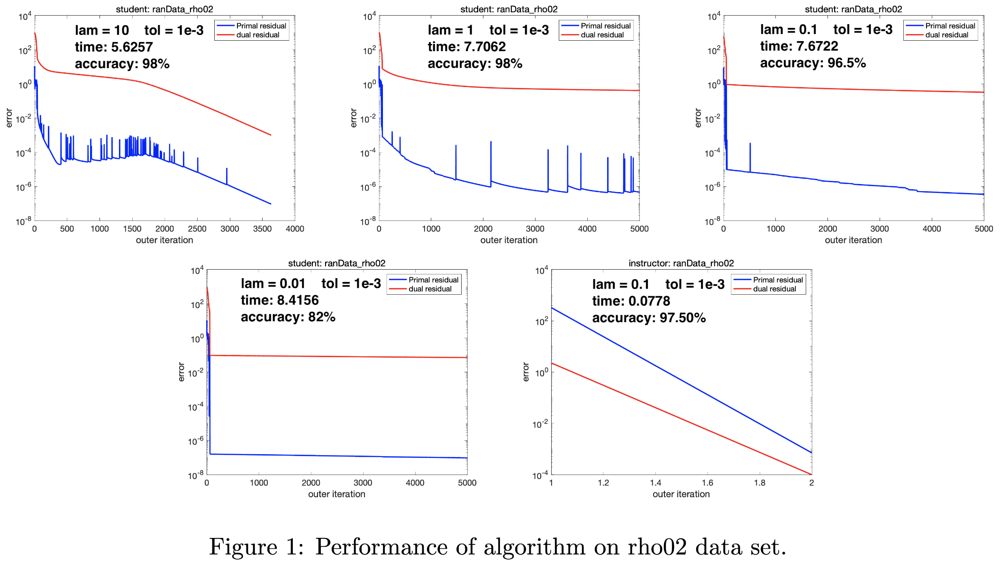
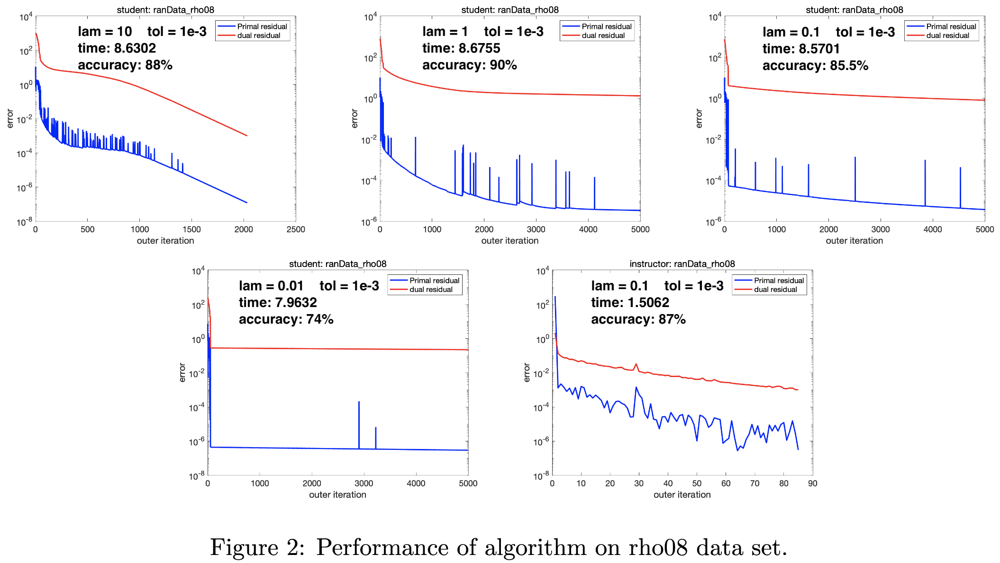
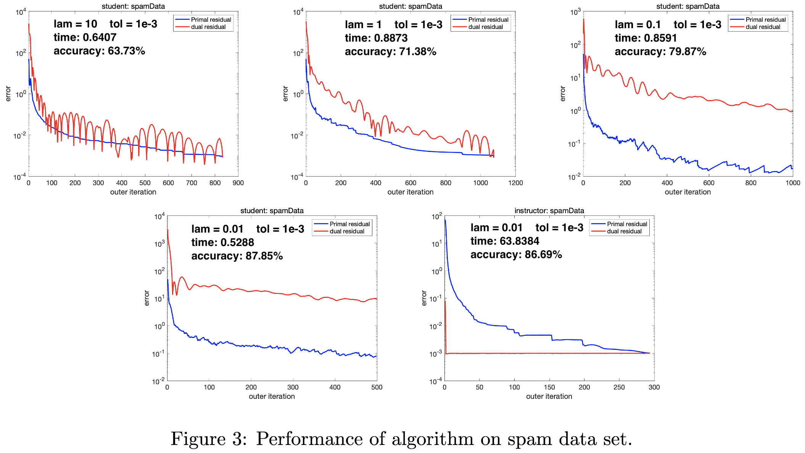

Check out Tianrui Qi's [Optimization](https://craft.tianrui-qi.com/optimization) 
Wiki page for more details about augmented Lagrangian method (ALM), alternating 
direction method of multipliers (ADMM), and other optimization algorithms.

## Formulate the primal problem

Given a set of data 

```math
\{ \left( \mathbf{x}_i, \mathbf{y}_i \right) \}^N_{i=1}
```

with $\mathbf{x}_i \in \mathbb{R}^p$ and the label 
$\mathbf{y}_i \in  \{ +1, -1 \}$ for each $i$, the linear support vector machine
(SVM) aims at finding a hyperplane  $\mathbf{x}\mathbf{w}+b = 1$ to separate the
two classes of data points. Suppose these points can be strictly separated; 
namely, there exists $\left( \mathbf{w}, b \right)$ such that 
$\mathbf{x}_i\mathbf{w} +b \geq 1$ if $\mathbf{y}_i = +1$ and 
$\mathbf{x}_i\mathbf{w} +b \leq 1$ if $\mathbf{y}_i = -1$, or equivalently 
$\mathbf{y}_i \left( \mathbf{x}_i \mathbf{w} +b \right)\geq 1$ for all $i$. To 
find a hyperplane with the maximum margin between the two classes, we solve the 
following problem:

```math
\max_{\mathbf{w} ,b} \frac{1}{\left\Vert \mathbf{w} \right\Vert  } :
\mathbf{y}_{i} \left( \mathbf{x} \mathbf{w}_{i} +b\right)  \geq 1,
\forall i=1,\cdots ,N
```

or equivalently

```math
\min_{\mathbf{w} ,b} \frac{1}{2} \left\Vert \mathbf{w} \right\Vert^{2}  :
\mathbf{y}_{i} \left( \mathbf{x} \mathbf{w}_{i} +b\right)  \geq 1,
\forall i=1,\cdots ,N
```

where $\left\Vert\cdot\right\Vert$ denotes the Euclidean norm (or 2-norm). 

While the feasibility of the above problems depends on the separability of the 
data, a soft-margin SVM is employed if the data points can not be strictly 
separated by solving the problem:

```math
\min_{\mathbf{w} ,b} \sum^{N}_{i=1} \mathbf{t}_{i} + 
\frac{\lambda }{2} \left\Vert \mathbf{w} \right\Vert^{2}  :
\mathbf{y}_{i} \left( \mathbf{x} \mathbf{w}_{i} +b\right)  \geq 
1-\mathbf{t}_{i},\mathbf{t}_{i}\geq 0,
\forall i=1,\cdots ,N
```

Note that at the optimal solution 
$\left( \bar{\mathbf{w} } ,\bar{b} ,\bar{\mathbf{ t}} \right)$, we must have 

```math
\bar{\mathbf{t} }_{i} =
\max \left( 
	0,
	1-\mathbf{y}_{i} \left( \mathbf{x}_{i} \bar{\mathbf{w} } +\bar{b} \right)  
\right).
```
 
Thus, we can rewrite the equation into 

```math
\min_{\mathbf{w} ,b} \sum^{N}_{i=1} 
\max \left( 
	0,
	1-\mathbf{y}_{i} \left( \mathbf{x}_{i} \bar{\mathbf{w} } +\bar{b} \right)  
\right)  +
\frac{\lambda }{2} \left\Vert \mathbf{w} \right\Vert^{2}  \qquad \lambda > 0
```

## Formulate augmented dual problem

Now, define

```math
\mathbf{X} =\mathbf{y} \cdot \begin{bmatrix}\mathbf{x} &\mathbf{1} \end{bmatrix} =
\begin{bmatrix}
	\mathbf{y}_{1} \mathbf{x}_{1,1} &\cdots 
	&\mathbf{y}_{1} \mathbf{x}_{1,p} &\mathbf{y}_{1} \\ 
	\vdots &\ddots &\vdots &\vdots \\ 
	\mathbf{y}_{N} \mathbf{x}_{N,1} &\cdots 
	&\mathbf{y}_{N} \mathbf{x}_{N,p} &\mathbf{y}_{N} 
\end{bmatrix} 
\in \mathbb{R}^{N\times \left( p+1\right)  }
```

```math
\mathbf{W} =
\begin{bmatrix}\mathbf{w} \\ b\end{bmatrix} \in \mathbb{R}^{\left( p+1\right)} 
\qquad 
\mathbf{Q} =
\begin{bmatrix}I&0\\ 0&0\end{bmatrix} \in 
\mathbb{R}^{\left( p+1\right)  \times \left( p+1\right)  }
```

we can rewrite the primal problem as 

```math
\min_{\mathbf{W} }  \sum^{N}_{i=1} \max \left( 
	0,
	1-\mathbf{X}_{i} \mathbf{W} 
\right)  +\frac{\lambda }{2} \| \mathbf{Q} \mathbf{W} \|^{2}
```

Introduce a variable $\mathbf{T}\in \mathbb{R}^{N}$ to rewrite the unconstrained
problem into constrained problem as follows

```math
\min_{\mathbf{T},\mathbf{W} } \sum^{N}_{i=1}
\max \left( 0,\mathbf{T}_{i} \right)+
\frac{\lambda }{2} \| \mathbf{Q} \mathbf{W} \|^{2}   
\qquad 
\mathbf{T} +\mathbf{X} \mathbf{W} =\mathbf{1}
```

Note that this is the standard problem that can be solved by ADMM. Note that the
problem can also be solved by augmented Lagrangian method (ALM), but for this 
derivation, we use ADMM. 

Let $\mathbf{u}\in \mathbb{R}^{N}$ be the Lagrangian multiplier, the augmented 
Lagrangian function is

```math
\begin{aligned}
	\mathcal{L}_{\beta } \left( \mathbf{T} ,\mathbf{W} ;\mathbf{u} \right)  = 
	&
	\sum^{N}_{i=1} \max \left( 0,\mathbf{T}_{i} \right)  +
	\frac{\lambda }{2} \| \mathbf{Q} \mathbf{W} \|^{2} 
	\\ 
	&
	+\mathbf{u}^{\top } \left( \mathbf{T} +\mathbf{X} \mathbf{W} -1\right)  +
	\frac{\beta }{2} 
	\left\Vert \mathbf{T} +\mathbf{X} \mathbf{W} -1\right\Vert^{2}_{2}  
\end{aligned} \qquad \lambda ,\beta >0
```

The goal is to solve the dual problem 

```math
\max_{\mathbf{u} } d_{\beta }\left( \mathbf{u} \right)  
\qquad 
d_{\beta }\left( \mathbf{u} \right)  = \min_{\mathbf{T} ,\mathbf{W} } 
\mathcal{L}_{\beta } \left( \mathbf{T} ,\mathbf{W} ;\mathbf{u} \right)
```

## Update scheme

Applying the ADMM to the dual problem we formulated above, we first solve

```math
\min_{\mathbf{T} ,\mathbf{W} } \mathcal{L}_{\beta } \left( \mathbf{T} ,\mathbf{W} ;\mathbf{u} \right)
```

by solving two subproblems

```math
\begin{aligned}\mathbf{W}^{\left( k+1\right)  } &=\arg \min_{\mathbf{W} } \mathcal{L}_{\beta } \left( \mathbf{T}^{\left( k\right)  } ,\mathbf{W} ;\mathbf{u}^{\left( k\right)  } \right)  \\ \mathbf{T}^{\left( k+1\right)  } &=\arg \min_{\mathbf{T} } \mathcal{L}_{\beta } \left( \mathbf{T} ,\mathbf{W}^{\left( k+1\right)  } ;\mathbf{u}^{\left( k\right)  } \right)  \end{aligned}
```

For $\mathbf{W}$,

```math
\begin{aligned}\mathbf{W}^{\left( k+1\right)  } &=\arg \min_{\mathbf{W} } \mathcal{L}_{\beta } \left( \mathbf{T}^{\left( k\right)  } ,\mathbf{W} ;\mathbf{u}^{\left( k\right)  } \right)  \\ &=\arg \min_{\mathbf{W} } \frac{\lambda }{2} \| \mathbf{Q} \mathbf{W} \|^{2} +\left( \mathbf{u}^{\left( k\right)  } \right)^{\top }  \left( \mathbf{T}^{\left( k\right)  } +\mathbf{X} \mathbf{W} -1\right)  +\frac{\beta }{2} \left\Vert \mathbf{T}^{\left( k\right)  } +\mathbf{X} \mathbf{W} -1\right\Vert^{2}_{2}  \end{aligned}
```

setting the gradient equal to zero, we have that

```math
\begin{aligned}\nabla_{\mathbf{W} } \mathcal{L}_{\beta } \left( \mathbf{T}^{\left( k\right)  } ,\mathbf{W} ;\mathbf{u}^{\left( k\right)  } \right)  &=\lambda \mathbf{Q} \mathbf{W} +\mathbf{X}^{\top } \mathbf{u}^{\left( k\right)  } +\beta \mathbf{X}^{\top } \left( \mathbf{T}^{\left( k\right)  } +\mathbf{X} \mathbf{W} -\mathbf{1}\right)  =0\\ \frac{\lambda }{\beta } \mathbf{Q} \mathbf{W}^{\left( k+1\right)  } &=-\frac{1}{\beta } \mathbf{X}^{\top } \mathbf{u}^{\left( k\right)  } -\mathbf{X}^{\top } \left( \mathbf{T}^{\left( k\right)  } +\mathbf{X} \mathbf{W}^{\left( k+1\right)  } -\mathbf{1}\right)  \\ \frac{\lambda }{\beta } \mathbf{Q} \mathbf{W}^{\left( k+1\right)  } +\mathbf{X}^{\top } \mathbf{X} \mathbf{W}^{\left( k+1\right)  } &=-\frac{1}{\beta } \mathbf{X}^{\top } \mathbf{u}^{\left( k\right)  } -\mathbf{X}^{\top } \left( \mathbf{T}^{\left( k\right)  } -\mathbf{1}\right)  \end{aligned}
```

```math
\left( \frac{\lambda }{\beta } \mathbf{Q} +\mathbf{X}^{\top } \mathbf{X} \right)  \mathbf{W}^{\left( k+1\right)  } =-\mathbf{X}^{\top } \left( \frac{1}{\beta } \mathbf{u}^{\left( k\right)  } +\mathbf{T}^{\left( k\right)  } -\mathbf{1} \right)
```

we get $\mathbf{W}^{\left( k+1\right)  }$ by solving the linear system. 
Note that 
$\left( \frac{\lambda }{\beta } \mathbf{Q} +\mathbf{X}^{\top } \mathbf{X} \right)$ is 
a constant, and we can compute it before the iteration start. For $\mathbf{T}$,

```math
\begin{aligned}\mathbf{T}^{\left( k+1\right)  } &=\arg \min_{\mathbf{T} } \mathcal{L}_{\beta } \left( \mathbf{T} ,\mathbf{W}^{\left( k+1\right)  } ;\mathbf{u}^{\left( k\right)  } \right)  \\ &=\arg \min_{\mathbf{T} } \sum^{N}_{i=1} \max \left( 0,\mathbf{T}_{i} \right)  +\left( \mathbf{u}^{\left( k\right)  } \right)^{\top }  \left( \mathbf{T} +\mathbf{X} \mathbf{W}^{\left( k+1\right)  } -\mathbf{1} \right)  +\frac{\beta }{2} \left\Vert \mathbf{T} +\mathbf{X} \mathbf{W}^{\left( k+1\right)  } -\mathbf{1} \right\Vert^{2}_{2}  \end{aligned}
```

setting the gradient equal to zero, we have that

```math
\begin{aligned}\nabla_{\mathbf{T} } \mathcal{L}_{\beta } \left( \mathbf{T} ,\mathbf{W}^{\left( k+1\right)  } ;\mathbf{u}^{\left( k\right)  } \right)  &=\sigma \left( \mathbf{T} \right)  +\mathbf{u}^{\left( k\right)  } +\beta \left( \mathbf{T} +\mathbf{X} \mathbf{W}^{\left( k+1\right)  } -\mathbf{1} \right)  =0\qquad \sigma_{i} =\begin{cases}1&\mathbf{T}_{i} \geq 0\\ 0&\mathbf{T}_{i} <0\end{cases} \\ \mathbf{T}^{\left( k+1\right)  } +\frac{1}{\beta } \sigma \left( \mathbf{T}^{\left( k+1\right)  } \right)  &=-\frac{1}{\beta } \mathbf{u}^{\left( k\right)  } -\mathbf{X} \mathbf{W}^{\left( k+1\right)  } +\mathbf{1} \end{aligned}
```

We have three cases:

```math
\mathbf{T}^{\left( k+1\right)  }_{i} =\begin{cases} \displaystyle \mathbf{C}_{i} -\frac{1}{\beta } &\displaystyle\frac{1}{\beta } <\mathbf{C}_{i} \\ 0&\displaystyle0\leq \mathbf{C}_{i} \leq \frac{1}{\beta } \\ \mathbf{C}_{i} &\mathbf{C}_{i} <0\end{cases}\qquad \mathbf{C}_{i} =-\frac{1}{\beta } \mathbf{u}^{\left( k\right)  }_i -\mathbf{X}_i \mathbf{W}^{\left( k+1\right)  } +1
```

Next, we solve

```math
\max_{\mathbf{u} } d_{\beta }\left( \mathbf{u} \right)
```

by setting

```math
\mathbf{u}^{\left( k+1\right)  } =\mathbf{u}^{\left( k\right)  } +\beta \left( \mathbf{T}^{\left( k+1\right)  } +\mathbf{X} \mathbf{W}^{\left( k+1\right)  } -\mathbf{1} \right)
```

## Stopping Condition

According to the derivation from the lecture, the primal residual is

```math
\left\Vert 
	\mathbf{T}^{\left( k+1\right)  } +
	\mathbf{X} \mathbf{W}^{\left( k+1\right)  } -\mathbf{1} 
\right\Vert_{2}
```

and the dual residual is

```math
\beta \left\Vert 
	\mathbf{X} \left( 
		\mathbf{W}^{\left( k+1\right)  } -\mathbf{W}^{\left( k\right)  } 
	\right)  
\right\Vert_{2}
```

We stop the algorithm when maximum of primal and dual residual less than `tol`.

Since we do not have any sub-iteration, we set the `maxit = 5000` and stop the 
algorithm when the iteration is larger than `maxit`.

## Results

We have three training datasets: [rho02](data/ranData_rho02.mat), 
[rho08](data/ranData_rho08.mat), and [spam](data/spamData.mat). 
Implementing the ADMM-based algorithm according to the derivation above, we test
our algorithm on these training datasets with different $\lambda$ by running 
[test_model_SVM_rho02.m](test_model_SVM_rho02.m), 
[test_model_SVM_rho08.m](test_model_SVM_rho08.m), and 
[test_model_SVM_spam.m](test_model_SVM_spam.m). 
Also, we run the algorithm [ALM_SVM_p.p](ALM_SVM_p.p)` provided by Prof. 
Yangyang Xu at the same time as criteria. 
Note that Prof. Xu use augmented Lagrangian method (ALM) instead of ADMM. 

The results are shown below, including the violation of primal and dual 
feasibility at each outer iteration, the time needed, and final accuracy. 
The accuracy increase as $\lambda$ increase.

-	[rho02](data/ranData_rho02.mat) 
-	[rho08](data/ranData_rho08.mat) 
-	[spam](data/spamData.mat) 		

## References

1. 	Final Project, *MATP 4820 Computational Optimization* by Prof. 
	[Yangyang Xu](https://www.linkedin.com/in/xu-yangyang-63633827/), 
	[Rensselaer Polytechnic Institute](https://www.rpi.edu).
2. 	Ye, Gui–Bo, Yifei Chen, and Xiaohui Xie. "Efficient variable selection in 
	support vector machines via the alternating direction method of 
	multipliers." *Proceedings of the Fourteenth International Conference on*
	*Artificial Intelligence and Statistics*. 
	JMLR Workshop and Conference Proceedings, 2011.
